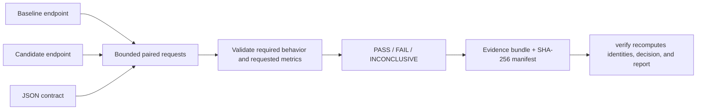

# Computelab Release Assurance

[](https://github.com/Smkzz/computelab-release-assurance/releases/latest)
[](https://github.com/Smkzz/computelab-release-assurance/actions/workflows/ci.yml)
[](https://www.python.org/)
[](LICENSE)

**Check an LLM deployment change against the behaviors your application actually requires.**

Computelab Release Assurance compares a baseline OpenAI-compatible endpoint with a candidate against an explicit [JSON contract](docs/contract.md). It records bounded client-side evidence using the documented [architecture and trust boundaries](docs/architecture.md) and returns a reproducible **PASS**, **FAIL**, or **INCONCLUSIVE** verdict.

**Who this is for:** engineers shipping or upgrading OpenAI-compatible LLM endpoints who want a deterministic regression check before deployment, without introducing a model judge.

**Contents:** [How it works](#how-it-works) · [Quick start](#quick-start) · [Compare deployments](#compare-deployments) · [Minimal contract](#minimal-contract) · [Evidence](#evidence-and-recovery) · [FAQ](#troubleshooting--faq) · [Security](#privacy-and-security) · [Development](#development-and-quality-gates)

### What it is

- A contract-driven baseline-versus-candidate regression checker.
- A bounded client-side runner for structured JSON, text, tool-call, and optional performance requirements.
- An evidence generator with deterministic reports, hashes, checkpointing, and verification.
- A CPU-only CLI with one runtime dependency, `jsonschema`.

### What it is not

- A model leaderboard, model judge, or general benchmark.
- A load generator, capacity test, or statistically qualified speed benchmark.
- A safety certification or proof of model correctness.
- An inference optimizer or model-server manager.

You choose the endpoints and acceptance contract. Python 3.11+ is supported; the tool requires no GPU, model weights, agent framework, or paid API by itself.

## How it works



The baseline must qualify before a candidate can pass. Missing evidence, transport incompleteness, unavailable required metrics, or an unverifiable comparison produces **INCONCLUSIVE** instead of silently passing.

## Quick start

From a source checkout:

```sh
python -m venv .venv
# Linux/macOS: source .venv/bin/activate
# Windows PowerShell: .venv\Scripts\Activate.ps1
python -m pip install .
computelab-release demo --output demo-output
```

The installed demo runs entirely on loopback with synthetic completions. It exercises a compatible candidate, a deliberate structured-output regression, and an unavailable candidate. The demo itself asserts the expected outcomes.

This is output captured from the local demo; manifest hashes will differ on another run:

```json
{
  "external_network": false,
  "scenarios": {
    "compatible": {
      "expected": "PASS",
      "manifest_sha256": "281f2a049c937dcd02f47d594e4cbe201feb2db250eda59026b71113aeeec05f",
      "observed": "PASS",
      "result_rows": 8,
      "verified": true
    },
    "regression": {
      "expected": "FAIL",
      "manifest_sha256": "443a01a8c51ea41f9fdc460376f840a010f90028ecf4db62a99263f901565063",
      "observed": "FAIL",
      "result_rows": 8,
      "verified": true
    },
    "unavailable": {
      "expected": "INCONCLUSIVE",
      "manifest_sha256": "6718c2f807eed0cd59e5038235b8809a1a7b0543c31fa53374dcc877180cc9df",
      "observed": "INCONCLUSIVE",
      "result_rows": 8,
      "verified": true
    }
  },
  "synthetic": true
}
```

Existing output directories are never deleted automatically.

For a terminal-style replay of the same verified demo, see the [asciinema v2 capture](docs/demo.cast). If asciinema is installed, replay it locally with `asciinema play docs/demo.cast`.

Inspect the synthetic regression:

```sh
computelab-release show demo-output/regression
computelab-release report demo-output/regression
computelab-release verify demo-output/regression
```

A report is ordinary Markdown. The included synthetic regression renders like this:

### FAIL

> This verdict applies only to the recorded contract, requests and client-side observations.

**Finding:** `candidate_compatibility_failure`

| Endpoint | Planned | Completed | Transport errors | Compatibility failures |
|---|---:|---:|---:|---:|
| baseline | 4 | 4 | 0 | 0 |
| candidate | 4 | 4 | 0 | 4 |

See the full [sample report](examples/report.md).

## Compare deployments

Use endpoints you own or are authorized to test. Requests can consume inference capacity; this tool never starts or modifies a model server.

```sh
computelab-release init upgrade-check
computelab-release register baseline upgrade-check --url http://127.0.0.1:8000/v1 --model baseline-model
computelab-release register candidate upgrade-check --url http://127.0.0.1:8001/v1 --model candidate-model
computelab-release define-contract upgrade-check --input examples/contract.json
computelab-release qualify upgrade-check
computelab-release verify upgrade-check
```

A successful `qualify` prints a small machine-readable result like this:

```json
{
  "report": "runs/<run_id>/report.md",
  "run_id": "<run_id>",
  "verdict": "PASS"
}
```

The following `verify` command should then return `"valid": true` with an empty `errors` list for a self-consistent evidence bundle.

For authenticated deployments, use **HTTPS** and `--api-key-env` to name an existing environment variable. Never place a key in a URL or contract. Plain HTTP is supported only for intentional unauthenticated local/private test deployments; bearer credentials over HTTP are rejected. Redirects and implicit proxy-environment use are disabled.

| Exit code | Meaning |
|---:|---|
| 0 | Successful command; `qualify` means PASS |
| 1 | Candidate failed the tested contract |
| 2 | Invalid input, interrupted run, or operational error |
| 3 | Qualification is INCONCLUSIVE |
| 4 | Evidence verification failed |

`report` prints Markdown. `show` and `verify` print JSON. Evidence verification and deployment qualification are deliberately separate: a self-consistent evidence bundle does not imply a passing candidate.

## Minimal contract

A contract can be small. This complete example asks both deployments to return JSON with a string `answer` field and requires two successful samples per side:

```json
{
  "schema_version": "release-assurance-contract/v1",
  "name": "Structured-output compatibility",
  "repeats": 2,
  "cases": [
    {
      "id": "structured-json-001",
      "messages": [
        {
          "role": "user",
          "content": "Return JSON with answer equal to healthy."
        }
      ],
      "expected_json_schema": {
        "type": "object",
        "required": ["answer"],
        "properties": {
          "answer": {"type": "string"}
        },
        "additionalProperties": false
      }
    }
  ],
  "acceptance": {
    "min_samples": 2,
    "max_failure_rate": 0,
    "max_malformed_output_rate": 0
  },
  "environment": {
    "candidate_must_match": []
  }
}
```

The repository includes a ready-to-edit version at [examples/contract.json](examples/contract.json).

## Contract checks

Contracts can require inline JSON Schema structure, exact JSON values, required text, and required function calls with argument subsets. Streaming tool fragments are reassembled before validation. Missing, truncated, oversized, malformed, or incomplete responses cannot silently become successful samples. See the [contract reference](docs/contract.md).

Optional performance limits operate on **observed client-side samples**. TTFT exists only for streamed content events. Time/token is an estimate that requires server-reported token counts; words are never substituted for tokens. The tool makes no confidence-interval, server-capacity, or causal speedup claim.

## Evidence and recovery

Each run records input snapshots, result rows, a deterministic report, and a SHA-256 manifest. Verification checks request coverage, input identities, required artifacts, hashes, and recomputes the decision and Markdown report from recorded rows.

For stronger tamper detection, store a manifest digest separately and verify it later:

```sh
computelab-release verify upgrade-check --expected-manifest <sha256>
```

The manifest establishes consistency, not publisher identity or truth of remote execution.

Runs checkpoint between requests. Resume only with unchanged inputs and policy:

```sh
computelab-release qualify upgrade-check --resume
```

An in-flight request at process death has an unknown remote outcome and is never silently replayed. Preserve that interrupted run and start a separate project for a fresh attempt.

## Troubleshooting / FAQ

**Why did I get INCONCLUSIVE instead of FAIL?**

INCONCLUSIVE means the comparison could not support a reliable candidate verdict. Common causes are an unverified or mismatched required environment field, too few successful samples, a baseline that did not itself qualify, candidate transport errors, an unavailable required timing metric, or an invalid performance reference such as a non-positive baseline p95.

**When should I use `--resume`?**

Only when the contract, deployments, runtime policy, and recorded run identity are unchanged. Resume continues from completed request checkpoints. An in-flight request from a terminated process is deliberately not replayed because its remote outcome is unknown.

**What if I changed the contract or deployment after an interrupted run?**

Do not force-resume it. Preserve the old evidence and start a new project/run so observations from different inputs cannot be mixed.

**Does `verify` mean the candidate passed?**

No. `verify` checks evidence consistency and recomputes the recorded decision. A valid evidence bundle can contain PASS, FAIL, or INCONCLUSIVE.

**Can I use an API key over plain HTTP?**

No. Bearer credentials require HTTPS. Plain HTTP is accepted only for intentional unauthenticated local/private testing.

## Privacy and security

**Treat project directories as private data.** They contain your contract, prompts, endpoint registration, and input snapshots. Raw response text is not retained by default; `safe_to_store` is an explicit opt-in intended for synthetic fixtures only. Hashes of low-entropy content are not anonymization.

The CLI trusts the local operator and contract author. It is not a hostile-local-user sandbox or an SSRF defense for a service that accepts untrusted endpoint URLs. See [SECURITY.md](SECURITY.md) and [architecture and limits](docs/architecture.md) for the exact trust boundaries.

## Development and quality gates

Install development dependencies and run:

```sh
python -m pip install -e ".[dev,security]"
python -m coverage run -m pytest -q
python -m coverage report -m
python -m coverage json -o coverage.json
python tools/check_quality.py coverage.json
python -m ruff check .
python -m ruff check src --select C901,PLR0911,PLR0912,PLR0915
python -m ruff format --check .
python -m mypy
python -m bandit -r src -q
python -m vulture src --min-confidence 80
python -m build
python tools/check_release.py
python tools/wheel_smoke.py
```

The quality gate requires at least **95% production branch coverage overall**, **90% for every production Python module**, **Radon A maintainability (MI ≥ 20) for every production module**, and **cyclomatic complexity ≤ 10 for every block**. Tests use synthetic loopback servers; hosted CI requires no inference credentials, paid APIs, GPUs, or self-hosted runners. See [CONTRIBUTING.md](CONTRIBUTING.md).

This is a pre-1.0 open-source project with best-effort maintenance and no support SLA. The current release is suitable for evaluation and real regression-checking workflows, but CLI and contract details may still evolve before 1.0.

## License

MIT for this source and documentation. Dependencies retain their own licenses and are installed separately. The repository does not redistribute model weights or third-party datasets.
